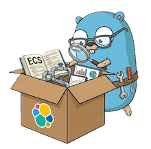

<p align="center">
  
</p>

# go-package-spec

Go library for
reading [Elastic integration packages](https://github.com/elastic/integrations)
into typed Go structs.

[](https://pkg.go.dev/github.com/andrewkroh/go-package-spec)

## Overview

`go-package-spec` provides a typed data model and package reader for Elastic
packages (integration, input, and content). The data model is generated
from [package-spec JSON schemas](https://github.com/andrewkroh/package-spec-schema),
ensuring it stays in sync with the specification.

The upstream [elastic/package-spec](https://github.com/elastic/package-spec)
defines its schemas in a non-standard YAML format (`.spec.yml` files) where the
schema is nested under a `spec` key, `$id` and `$ref` usage doesn't conform to
JSON Schema conventions.
The [package-spec-schema](https://github.com/andrewkroh/package-spec-schema)
project converts these into
standard [JSON Schema (draft 2020-12)](https://json-schema.org/draft/2020-12)
with proper `$id` URIs and `$ref` resolution, which this library's code
generator consumes.

## Features

- Typed data model generated from package-spec JSON schemas (manifests, fields,
  pipelines, changelogs, etc.)
- Package reader that loads full packages from disk via `io/fs.FS`
- File metadata annotations — every decoded type tracks its source file, line,
  and column
- Ingest pipeline processor parsing with type detection
- Kibana saved object loading with partial attribute decoding
- Security detection rule extraction — rule metadata, MITRE ATT&CK mappings,
  related integrations, required fields, index patterns, and tags
- Git metadata enrichment (commit ID, changelog dates via blame)
- Image metadata extraction (dimensions, byte sizes)
- Documentation file discovery (README, docs, knowledge base) with optional
  content loading
- Agent Handlebars template loading
- Field flattening — expands nested group hierarchies into dot-joined names
  with optional [ECS](https://github.com/andrewkroh/go-ecs) enrichment via
  callback
- SQLite loading — inserts packages into a SQLite database with a
  self-documenting schema (table/column comments preserved in `sqlite_master`)
- FTS5 full-text search over package documentation, changelog entries, and
  security detection rules (porter stemming, external content mode,
  auto-generated field tables stripped from doc content)

## Install

```sh
go get github.com/andrewkroh/go-package-spec
```

## Quick start

```go
package main

import (
	"fmt"
	"log"

	"github.com/andrewkroh/go-package-spec/pkgreader"
)

func main() {
	pkg, err := pkgreader.Read("path/to/package")
	if err != nil {
		log.Fatal(err)
	}

	m := pkg.Manifest()
	fmt.Printf("%s %s (%s)\n", m.Name, m.Version, m.Description)

	for name, ds := range pkg.DataStreams {
		fmt.Printf("  data_stream: %s (%d fields, %d pipelines)\n",
			name, len(ds.AllFields()), len(ds.Pipelines))
	}
}
```

## Examples

See the [`example/`](example/) directory:

- **[processor_count](example/processor_count/)** — Counts ingest pipeline
  processors by type across all pipelines in a package.
- **[field_locations](example/field_locations/)** — Prints each field's name
  with its source file:line:column location, demonstrating the FileMetadata
  annotation feature.
- **[flatten_fields](example/flatten_fields/)** — Flattens nested group fields
  into dot-joined names and prints sorted results with types and locations.

## SQLite database (`pkgsql`)

The `pkgsql` package loads packages into a SQLite database for SQL-based
analysis. It normalizes the package data into relational tables — packages,
data streams, fields, policy templates, ingest pipelines, processors, vars,
changelogs, and more — making it easy to query across the entire
[elastic/integrations](https://github.com/elastic/integrations) corpus.

The schema is self-documenting: every table and column has a descriptive
comment embedded inside the `CREATE TABLE` statement, so they are preserved
in `sqlite_master` and accessible to LLMs and other consumers without
access to the Go source.

```go
import (
	"database/sql"

	"github.com/andrewkroh/go-package-spec/pkgreader"
	"github.com/andrewkroh/go-package-spec/pkgsql"
	
	_ "modernc.org/sqlite"
)

db, _ := sql.Open("sqlite", "packages.db")

// Load a package from disk.
pkg, _ := pkgreader.Read("path/to/package")

// Insert into the database (creates tables + inserts within a transaction).
pkgsql.WritePackages(ctx, db, []*pkgreader.Package{pkg})
```

The public API is intentionally small:

- `WritePackages` — creates tables and inserts multiple packages
- `WritePackage` — inserts a single package (tables must already exist)
- `TableSchemas` — returns the `CREATE TABLE` / `CREATE VIRTUAL TABLE` statements
- `WithECSLookup` — option to enrich fields with ECS definitions during insert
- `WithDocContent` — option to load doc file markdown content into the `docs` table
- `OSDocReader` — convenience `DocReader` that reads from the OS filesystem
- `RebuildFTS` — rebuilds all FTS5 full-text search indexes (called
  automatically by `WritePackages`; must be called manually after using
  `WritePackage` directly)

`pkgsql` depends only on `database/sql` — bring your own SQLite driver.

### Pre-built database

A pre-built SQLite database containing all
[elastic/integrations](https://github.com/elastic/integrations) package
metadata is built daily via GitHub Actions. Downloading artifacts requires
GitHub authentication (even for public repos).

```sh
# Requires: gh auth login
gh run download --repo andrewkroh/go-package-spec \
  --name fleet-packages-sqlite \
  --dir .

gunzip fleet-packages.sqlite.gz
```

The artifact is a gzipped SQLite file (~15 MB compressed) that is recreated
daily. The database contains metadata from
[elastic/integrations](https://github.com/elastic/integrations), which is
licensed under the [Elastic License 2.0](https://github.com/elastic/integrations/blob/main/LICENSE.txt)
and is not covered by this project's Apache 2.0 license.

## Versioning

This project uses independent [semantic versioning](https://semver.org) for
the Go module. The `pkgspec.SpecVersion` constant tells consumers which
package-spec schema version the types were generated from.

The Go module version and spec version are decoupled — a new module release
may update the spec version, add features, or fix bugs independently.

## License

Apache License 2.0. See [LICENSE](LICENSE) for details.
